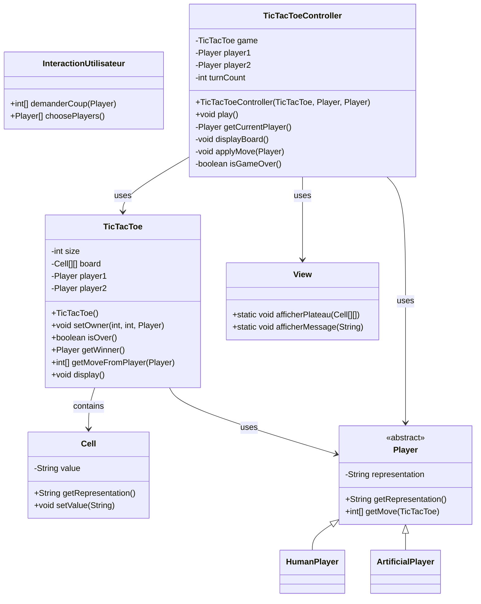

```mermaid
classDiagram
%% ===== Modèle =====
    class TicTacToe {
        -int size
        -Cell[][] board
        -Player player1
        -Player player2
        +TicTacToe()
        +void setOwner(int, int, Player)
        +boolean isOver()
        +Player getWinner()
        +int[] getMoveFromPlayer(Player)
        +void display()
    }
    TicTacToe --> Cell : contains
    TicTacToe --> Player : uses

%% ===== Player =====
    class Player {
        <<abstract>>
        -String representation
        +String getRepresentation()
        +int[] getMove(TicTacToe)
    }
    class HumanPlayer
    class ArtificialPlayer
    Player <|-- HumanPlayer
    Player <|-- ArtificialPlayer

%% ===== Cell =====
    class Cell {
        -String value
        +String getRepresentation()
        +void setValue(String)
    }

%% ===== Vue =====
    class View {
        +static void afficherPlateau(Cell[][])
        +static void afficherMessage(String)
    }
    class InteractionUtilisateur {
        +int[] demanderCoup(Player)
        +Player[] choosePlayers()
    }

%% ===== Contrôleur =====
    class TicTacToeController {
        -TicTacToe game
        -Player player1
        -Player player2
        -int turnCount
        +TicTacToeController(TicTacToe, Player, Player)
        +void play()
        -Player getCurrentPlayer()
        -void displayBoard()
        -void applyMove(Player)
        -boolean isGameOver()
    }
    TicTacToeController --> TicTacToe : uses
    TicTacToeController --> Player : uses
    TicTacToeController --> View : uses

```